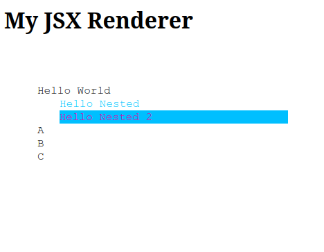

# noreact

A basic and very stupid JSX renderer.

No States. No Hooks. No Effects.
Just JSX.

Before

```Typescript
  const container = document.createElement("div");
  const button = document.createElement("button");

  container.style["display"] = "float";
  container.style["justify-content"] = "center";
  container.style["width"] = "100%";

  button.setAttribute("id", "mybutton");
  button.addEventListener("click", () => { console.log("clicked") });
  container.appendChild(button);
  document.body.appendChild(container);
```

Now

```JSX
  var rootNode = NoReact.createRoot(document.body);
  rootNode.render(
    <div style={{ display: "flex", justifyContent: "center", width: "100%" }}>
      <button id="mybutton" onClick={() => {console.log("clicked") }}></button>
    </div>
  );
```

Yeah, I know. Re-inventing the wheel. But I needed a quick and un-sophisticated JSX renderer.

Fun fact: Refs exist. This is my way of accesseing the rendered DOM node later.

## Example

See ./src/TestApp.tsx and ./test/index.js and ./test/index.html

TestApp.tsx

```Typescript
import NoReact from "./NoReact";
import { JsxElement } from "typescript";

export const TestApp = (name: string): JsxElement => {
  const click1 = () => {
    console.log("First clicked");
  };

  const click2 = () => {
    console.log("Second clicked");
  };

  const mouseEnter = (event: Event) => {
    (event.target as HTMLDivElement).style["background-color"] = "grey";
  };

  const mouseOut = (event: Event) => {
    (event.target as HTMLDivElement).style["background-color"] = "DeepSkyBlue";
  };

  return (
    <div className="NoReact-main" style={{ padding: "3em" }}>
      Hello {name}
      <div className="NoReact-child-1" onClick={click1}>
        Hello Nested
      </div>
      <div
        className="NoReact-child-2"
        onClick={click2}
        onMouseEnter={mouseEnter}
        onMouseOut={mouseOut}
        style={{ backgroundColor: "yellow" }}
      >
        Hello Nested 2
      </div>
      <div>
        {["A", "B", "C"].map((text: string) => {
          return <div>{text}</div>;
        })}
      </div>
    </div>
  );
};
```

index.html

```html
<!DOCTYPE html>
<html lang="en">
  <head>
    <meta charset="UTF-8" />
    <meta name="viewport" content="width=device-width, initial-scale=1.0" />
    <meta http-equiv="X-UA-Compatible" content="ie=edge" />
    <title>Test my JSX renderer</title>
    <link rel="stylesheet" href="./style.css" />
    <link rel="icon" href="./favicon.ico" type="image/x-icon" />
    <script src="./exports.js"></script>
    <script src="./require.js"></script>
    <script src="../dist/noreact-main.js"></script>
    <script src="./index.js"></script>
  </head>
  <body>
    <main>
      <h1>My JSX Renderer</h1>
      <div id="root"></div>
    </main>
  </body>
</html>
```

index.js

```Javascript
window.addEventListener("load", function () {
  console.log("load event");
  function log(html) {
    console.log(html);
  }

  var rootNode = NoReact.createRoot(document.getElementById("root"));
  rootNode.render(NoReact.TestApp("World"));
});
```

### Result

Run `npm run server` and call http://127.0.0.1:8080 in your browser.


